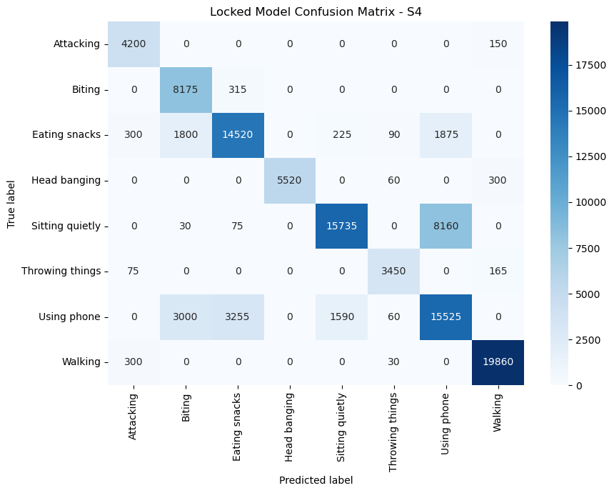
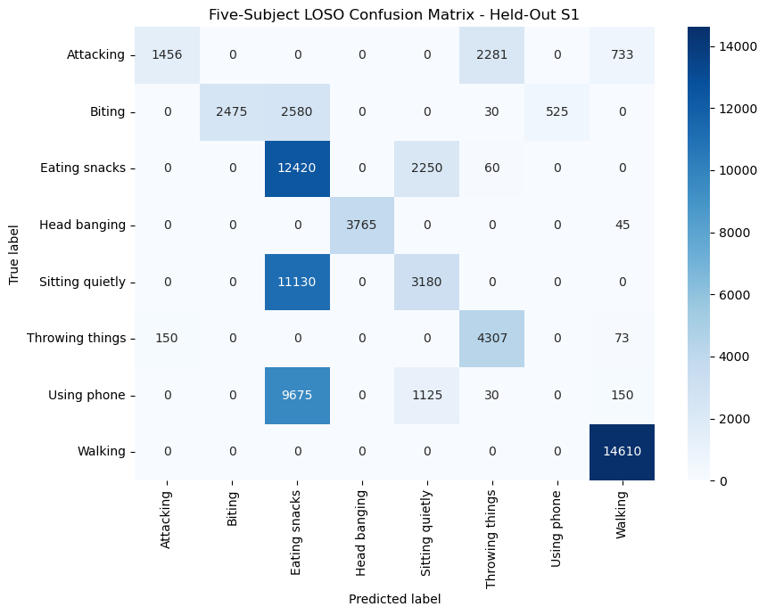
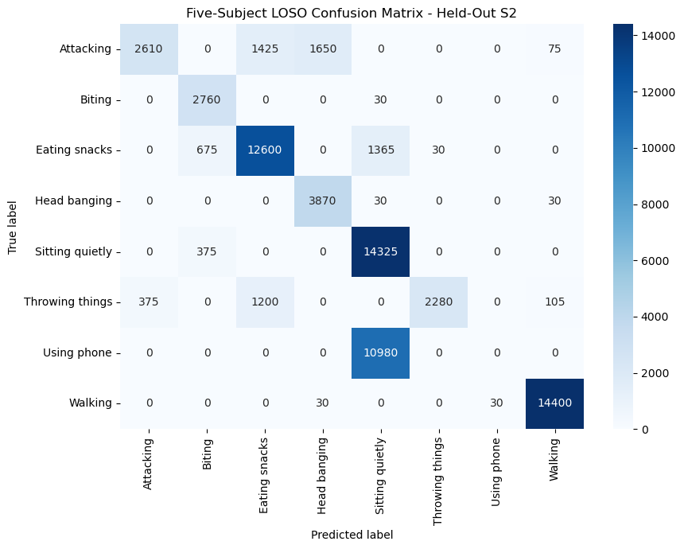
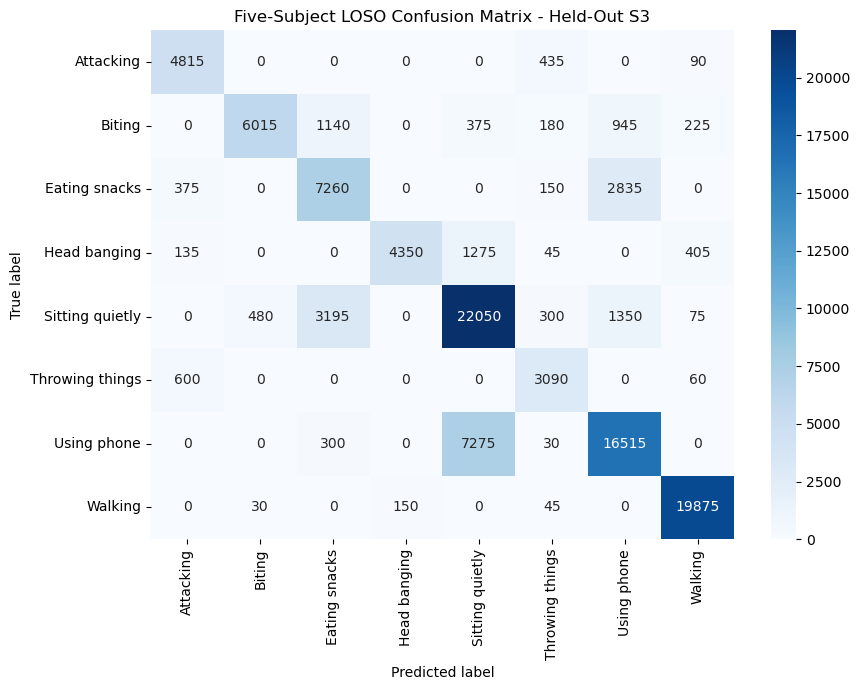
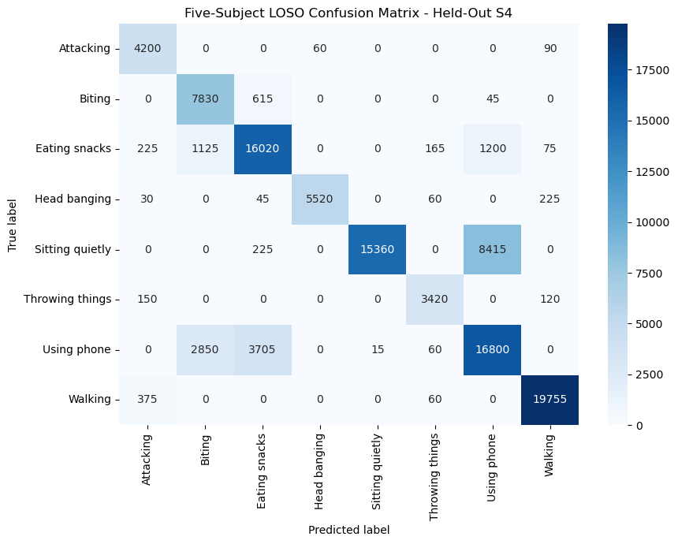
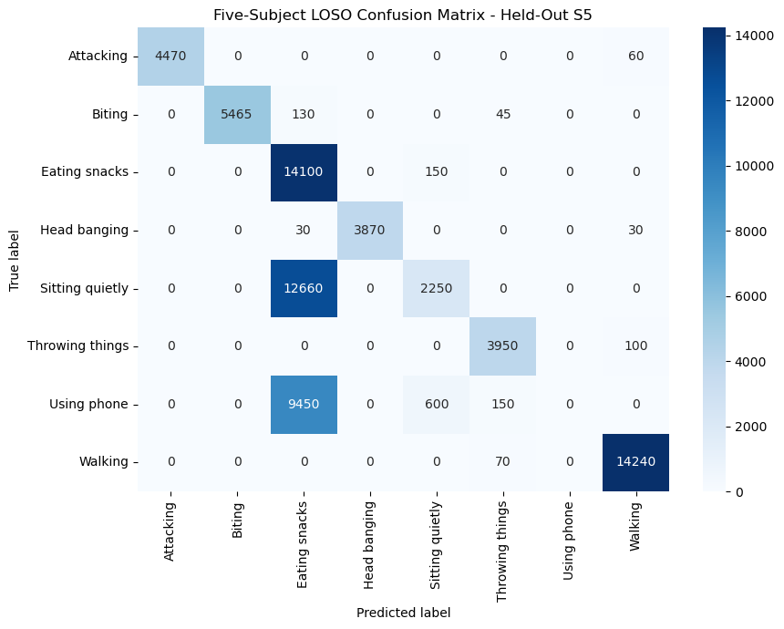

# Privacy-Preserving Keypoint Activity Recognition

Reproducible code and artifacts for eight-class human behavior recognition from 2D pose time series. The repository accompanies the paper **"Human Behavior Recognition Using 2D Time-Series Data and Machine Learning Models"** and provides a V7-compatible TSFEL + HistGradientBoosting baseline, leakage-free LOSO evaluation, controlled Phase D upgrades, unseen-participant inference, and final five-subject export.

Paper DOI: [10.1088/1742-6596/3180/1/012004](https://doi.org/10.1088/1742-6596/3180/1/012004)

## About

This repository accompanies my first published paper. I am Chinh Tan Ly, the paper's first author, and this work was co-authored with Assoc. Prof. Quang Linh Huynh. The repository preserves the complete reproducible path from the original V7-compatible pipeline to the leakage-free Phase D evaluation and deployment artifacts.

## Main Result

The selected method is **D3u**: V7-compatible experiment-C features, training-only feature selection, regularized HistGradientBoosting, and nested Viterbi decoding.

| Protocol | Accuracy | Macro F1 | Abnormal F1 |
|---|---:|---:|---:|
| Development LOSO on S1/S2/S3/S5 | 58.38% | 56.84% | 69.71% |
| S4 secondary evaluation | 79.92% | 84.10% | 86.79% |
| Five-subject LOSO | 73.31% | 76.39% | 89.34% |

These protocols use different training sets and must not be averaged or directly compared with the paper's original window-level results. See [Paper Alignment and Future Work](docs/PAPER_AND_FUTURE_WORK.md).

## Confusion Matrices

These PNG files are extracted unchanged from the executed V11 notebook outputs. The underlying CSV matrices remain available under `artifacts/phase_d/` for numerical inspection.

### Locked Four-Subject Model Evaluated on S4



### Final Five-Subject LOSO

| Held-Out S1 | Held-Out S2 |
|---|---|
|  |  |

| Held-Out S3 | Held-Out S4 |
|---|---|
|  |  |

| Held-Out S5 |
|---|
|  |

## Method

1. Clean 17 COCO keypoints and normalize pose relative to the torso.
2. Build 150-frame windows at 30 FPS.
3. Extract TSFEL and handcrafted position, velocity, acceleration, geometry, symmetry, and hand-to-face features.
4. Fit feature selection only on training subjects.
5. Select HistGradientBoosting hyperparameters with nested subject-level validation.
6. Infer validation/test streams with fixed-stride windows created without labels.
7. Select Viterbi transition strength inside nested LOSO.

`Throwing` and `Throwing things` are merged. `None` is treated as transition/other content and is not one of the eight challenge classes.

## Start Here

- `ISAS_CHALLENGE_v11_PHASE_D_ACCURACY_ENGLISH_EXECUTED.ipynb`: executed English report with one result section per subject.
- `ISAS_CHALLENGE_v11_PHASE_D_ACCURACY_ENGLISH.ipynb`: clean source notebook.
- `artifacts/phase_d/locked_phase_d_subjects_1_2_3_5.joblib`: four-subject model used to predict S4.
- `artifacts/phase_d/final_phase_d_all_five_subjects.joblib`: final all-five desktop model.
- `outputs/phase_d/submission_phase_d.csv`: challenge-format S4 submission.
- `paper/Ly_2026_J_Phys_Conf_Ser_3180_012004_corrected_author_copy.pdf`: author-corrected paper copy with the duplicated Figure 1 stage removed.

## Installation

```powershell
python -m venv .venv
.\.venv\Scripts\Activate.ps1
python -m pip install -r requirements.txt
```

Pass dataset locations explicitly through the CLI arguments. Notebook configuration cells also accept `KEYPOINT_DATA_DIR`, `KEYPOINT_TEST_FILE`, and `KEYPOINT_S4_LABEL_FILE` environment variables.

## Predict a New Participant

```powershell
python predict_phase_d.py `
  --model artifacts/phase_d/final_phase_d_all_five_subjects.joblib `
  --input E:\path\to\new_keypoints.csv `
  --output outputs/new_participant_predictions.csv `
  --participant-id 6
```

The script writes a filled prediction CSV and a second challenge-format file containing `participant_id,timestamp,predicted_label`.

## Reproduce Phase D

The experiment is checkpointed because TSFEL extraction and nested LOSO are expensive:

```powershell
python build_phase_d_c_inference_cache.py --help
python run_phase_d_unbiased_d01.py --help
python run_phase_d_d3.py --help
python run_phase_d_finalize.py
python run_phase_d_lock_s4.py --help
python run_phase_d_five_subject.py --help
```

D2 and D4 scripts are included as documented negative experiments. They are not part of the locked model.

## Validation

```powershell
python -m pytest tests -p no:cacheprovider -q
python build_phase_d_notebook.py
jupyter nbconvert --to notebook --execute `
  ISAS_CHALLENGE_v11_PHASE_D_ACCURACY_ENGLISH.ipynb `
  --output ISAS_CHALLENGE_v11_PHASE_D_ACCURACY_ENGLISH_EXECUTED.ipynb
```

The verified repository state passes 70 tests. The executed V11 notebook contains no cell errors, both exported models load successfully, and the generic inference entry point has been smoke-tested on a continuous keypoint stream.

## Paper Correction

The publisher PDF contains a duplicated segmentation box in Figure 1. The copy under `paper/` replaces only that figure and is explicitly labeled as an **author-corrected copy**, not a publisher correction. The reproducible correction script is `tools/fix_paper_figure1.py`.

## Deployment Boundary

The `.joblib` artifacts are desktop reference models. TSFEL and HistGradientBoosting do not run directly on ESP32. Embedded deployment requires feature-compatible distillation or a compact int8 temporal model; the proposed validation protocol is documented in [Paper Alignment and Future Work](docs/PAPER_AND_FUTURE_WORK.md).

## Data

Raw participant CSV files are not included. They may contain challenge-controlled or sensitive behavioral data. Place authorized data outside the repository and supply its location through the CLI arguments.

### Dataset Attribution

The challenge dataset was provided by **Taihei Fujioka, Christina Garcia, and Sozo Inoue** for *Challenge: Abnormal Activity Detection in Individuals with Developmental Disabilities* (2025). Users of the challenge data should cite the dataset providers in addition to the associated research paper below.

## Citation

```bibtex
@article{ly2026human,
  author  = {Ly, Chinh Tan and Huynh, Quang Linh},
  title   = {Human Behavior Recognition Using 2D Time-Series Data and Machine Learning Models},
  journal = {Journal of Physics: Conference Series},
  volume  = {3180},
  pages   = {012004},
  year    = {2026},
  doi     = {10.1088/1742-6596/3180/1/012004}
}

@misc{fujioka2025challenge,
  author = {Fujioka, Taihei and Garcia, Christina and Inoue, Sozo},
  title  = {Challenge: Abnormal Activity Detection in Individuals with Developmental Disabilities},
  year   = {2025},
  note   = {Challenge dataset and task specification}
}
```

## License

Repository source code is released under the [MIT License](LICENSE). The included article remains under its stated [Creative Commons Attribution 4.0 license](paper/README.md). The trained models, generated predictions, and evaluation artifacts are provided for research reproducibility; their availability does not grant rights to the underlying challenge dataset. Dataset access and use remain subject to the terms set by Taihei Fujioka, Christina Garcia, Sozo Inoue, and the challenge organizers.
